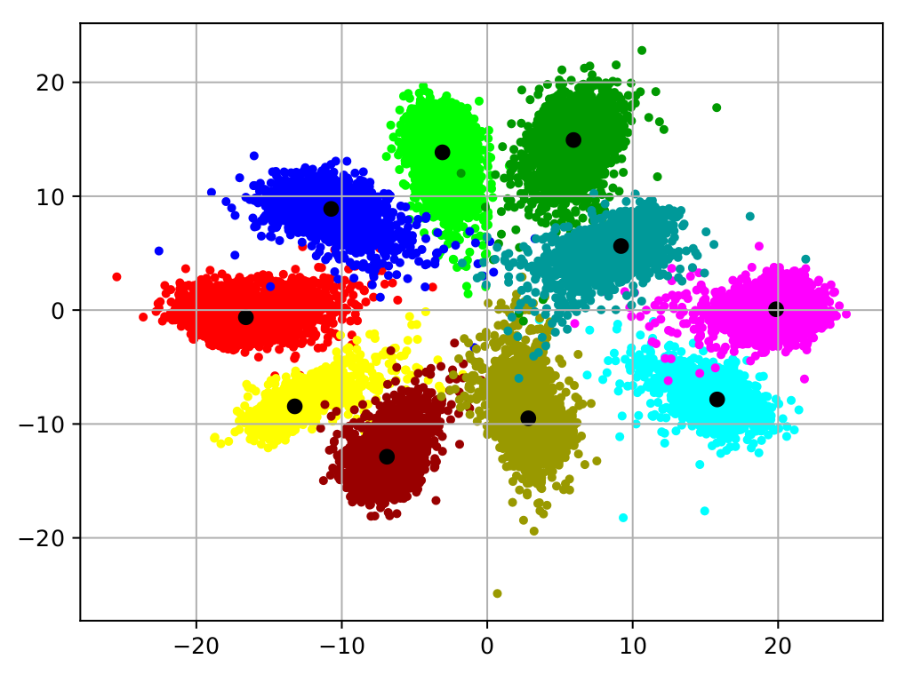

# Git_Loss_For_Deep_Face_Recognition
This repository contains code for the paper "Git Loss for Deep Face Recognition". 

## Usage
Standard Gitloss methodology:

Following dependencies are required for the code:

<ol>
  <li>Tensorflow >= 1.4 </li>
  <li>Numpy</li>
  <li>Matplotlib</li>
</ol>
This code is for MNIST (mentioned in paper). For VGGFace2, you may use the code provided by <a href="https://github.com/davidsandberg/facenet">facenet</a>. Use the function `get_git_loss()` from the `gitloss.py` in facenet to use VGGFace2. 

To run the code: `python3 gitloss.py`

## Results 
Following are the plots of Gitloss and Centerloss [1].
### Gitloss: 

### Centerloss: 

## Citation

## References
[1] https://ydwen.github.io/papers/WenECCV16.pdf
